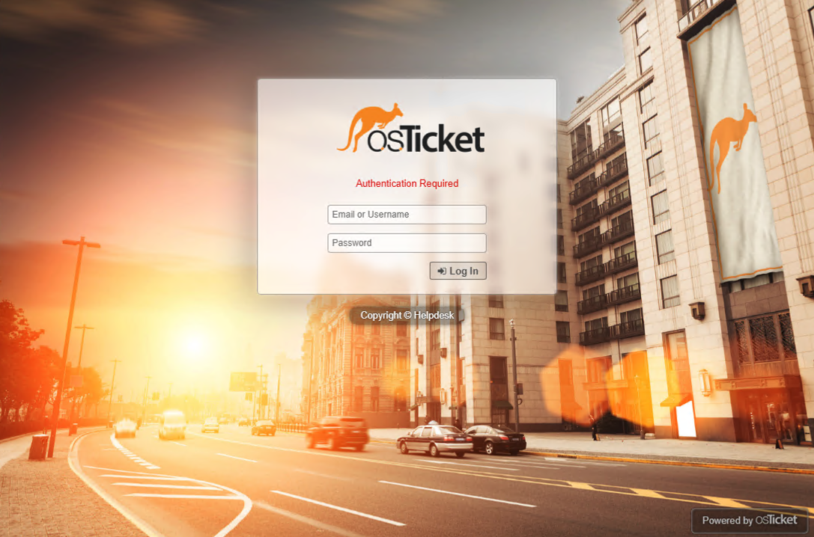

# osTicket Installation on Windows 10 Azure VM

## Overview

This project demonstrates how to install and configure **osTicket**, an open-source support ticket system, on a Windows 10 virtual machine (VM) in Azure. The lab covers the installation of required dependencies such as IIS, PHP, MySQL, and **osTicket** itself, and it concludes with setting up the helpdesk system for both admins and end-users.

## Prerequisites

Before starting this setup, make sure you have the following:

1. **Azure Account** – You will need an Azure account to create a Windows 10 Virtual Machine.
2. **osTicket Installation Files** – Download the [osTicket-Installation-Files.zip](https://drive.usercontent.google.com/download?id=1b3RBkXTLNGXbibeMuAynkfzdBC1NnqaD&export=download&authuser=0) for installation dependencies (PHP, MySQL, etc.).
3. **Remote Desktop Access** – Ensure that you have RDP access to the Windows 10 VM created in Azure.
4. **HeidiSQL** – A lightweight SQL client for managing MySQL databases, which will be used to configure the MySQL database for osTicket.

## Setup Instructions

Follow these step-by-step instructions to install osTicket on your Windows 10 VM:

## 1. Create a Windows 10 Virtual Machine in Azure

- **VM Name**: osticket-vm  
- **Username**: labuser  
- **Password**: osTicketPassword1!  

Access the VM via Remote Desktop after it's created.

---

## 2. Prepare the Virtual Machine for osTicket Installation

#### 1. Download osTicket Installation Files

- Download and unzip `osTicket-Installation-Files.zip` to your desktop. The folder will be named `osTicket-Installation-Files`.

#### 2. Install IIS with CGI

- Open **Windows Features** (`Control Panel > Programs > Turn Windows Features on or off`).
- Enable **Internet Information Services (IIS)** > **World Wide Web Services** > **Application Development Features** > **CGI**.

---

## 3. Install Dependencies

#### 1. PHP Manager for IIS

- From the `osTicket-Installation-Files` folder, run the `PHPManagerForIIS_V1.5.0.msi` file to install PHP Manager.

#### 2. Install URL Rewrite Module

- Run the `rewrite_amd64_en-US.msi` from the same folder to install the URL Rewrite Module.

#### 3. Create the `C:\PHP` Directory

- Manually create a directory at `C:\PHP` for PHP installation.

#### 4. Install PHP 7.3.8

- Unzip `php-7.3.8-nts-Win32-VC15-x86.zip` into the `C:\PHP` directory.

#### 5. Install Visual C++ Redistributable

- Install `VC_redist.x86.exe` from the `osTicket-Installation-Files` folder.

#### 6. Install MySQL 5.5.62

- Run the `mysql-5.5.62-win32.msi` file and choose **Typical Setup**.
- During installation, set up the MySQL root user with the password `root`.

---

## 4. Configure IIS for PHP

#### 1. Register PHP with IIS

- Open **IIS Manager** and navigate to **PHP Manager**.
- Register PHP by pointing IIS to `C:\PHP\php-cgi.exe`.

#### 2. Reload IIS

- Stop and start IIS via **IIS Manager** for the changes to take effect.

---

## 5. Install osTicket

#### 1. Copy osTicket Files

- Unzip `osTicket-v1.15.8.zip` and copy the `upload` folder into `C:\inetpub\wwwroot`.
- Rename the folder `upload` to `osTicket`.

#### 2. Reload IIS

- Stop and start IIS again.

#### 3. Access osTicket in the Browser

- In **IIS Manager**, go to **Sites > Default > osTicket** and click on **Browse :80** to open osTicket in your web browser.

#### 4. Enable PHP Extensions

- In **IIS Manager**, under **PHP Manager**, enable the following extensions: 
  - `php_imap.dll`
  - `php_intl.dll`
  - `php_opcache.dll`
- Refresh the osTicket page in your browser to see the changes.

---

## 6. Complete osTicket Configuration

#### 1. Rename Configuration File

- Rename the `ost-sampleconfig.php` file to `ost-config.php` located in `C:\inetpub\wwwroot\osTicket\include`.

#### 2. Set Permissions for `ost-config.php`

- Right-click on `ost-config.php > Properties > Security`.
- Disable inheritance and remove all permissions.
- Add **Everyone** with **Full Control** permissions.

#### 3. Complete osTicket Setup in Browser

- Open osTicket in your browser and continue the setup wizard: 
  - **Helpdesk Name**: Enter a name for your helpdesk.
  - **Default Email**: Enter an email for the helpdesk to receive customer requests.

#### 4. Set Up the Database

- Download and install HeidiSQL from the `osTicket-Installation-Files` folder.
- Open HeidiSQL, create a new session with `root` as both the username and password, and connect to the session.
- Create a new database named `osTicket`.

#### 5. Connect osTicket to MySQL

- In the osTicket setup wizard, enter: 
  - **MySQL Database**: `osTicket`
  - **MySQL Username**: `root`
  - **MySQL Password**: `root`
- Click **Install Now!**.

---

## 7. Access Your osTicket System

After installation completes successfully, access your admin panel via:

- **Admin Login URL**: `http://localhost/osTicket/scp/login.php`

For end-users, access the helpdesk portal at:

- **End-User URL**: `http://localhost/osTicket/`

---

## 8. Clean Up

#### 1. Delete Setup Folder

- Delete the `setup` folder from `C:\inetpub\wwwroot\osTicket` to secure the installation.

#### 2. Set Permissions to Read-Only

- Set the `ost-config.php` file to **Read-only** to prevent any unauthorized modifications.

You’ve now installed and configured **osTicket** on a Windows 10 VM in Azure! This setup will provide a fully functional helpdesk system that can be used for managing support tickets.

---

# osTicket: Admin and Agent Panel Configuration Workflow

## Admin Panel vs Agent Panel

### Admin Panel
- The **Admin Panel** is where administrators and analysts manage the core system settings, configurations, and users.
- Access it by visiting:  
  **Admin Login URL**: `http://localhost/osTicket/scp/login.php`  
  **Admin Username**: your admin credentials  
  **Admin Password**: your admin password

### Agent Panel
- The **Agent Panel** is where support agents can view and manage tickets.
- Access it by visiting:  
  **End-User URL**: `http://localhost/osTicket/`  
  This panel provides agents with a streamlined interface for responding to support requests and managing tickets.

---

## Step-by-Step Configuration Guide

## 1. Configure Roles for Agents (Grouping Permissions)

1. Log into the **Admin Panel**.
2. Navigate to **Agents** > **Roles**.
3. Click **Add New** to create a new role.
4. Name the role **Supreme Admin** (or another role as needed).
5. Assign permissions as needed (you can allow full access or restricted access based on role).
6. Click **Save Changes**.

## 2. Configure Departments for Ticket Visibility

1. In the **Admin Panel**, go to **Agents** > **Departments**.
2. Click **Add New**.
3. Name the department, for example, **SysAdmins**.
4. Set ticket visibility rules (Who can view tickets assigned to this department).
5. Click **Save Changes**.

## 3. Configure Teams (Pulling Agents from Different Departments)

1. Navigate to **Agents** > **Teams**.
2. Click **Add New**.
3. Name the team (e.g., **Online Banking**).
4. Select agents from different departments to be part of the team.
5. Click **Save Changes**.

## 4. Allow Anyone to Create Tickets (User Registration)

1. In the **Admin Panel**, go to **Settings** > **User Settings**.
2. Uncheck **Unregistered users can create tickets** (this will require users to log in before submitting a ticket).
3. Check **Registration Required** (users will need to create an account to submit tickets).
4. Click **Save Changes**.

## 5. Configure Agents (Support Staff)

1. In the **Admin Panel**, navigate to **Agents** > **Add New**.
2. Add the following agents:  
   - **Jane** – Department: SysAdmins  
   - **John** – Department: Support  
3. Click **Save Changes**.

## 6. Configure Users (Customers)

1. Log into the **Agent Panel**.
2. Navigate to **Users** > **Add New**.
3. Add the following users:  
   - **Karen**  
   - **Ken**  
4. Click **Save Changes**.

## 7. Configure SLA (Service Level Agreements)

1. In the **Admin Panel**, go to **Manage** > **SLA**.
2. Add the following SLAs:  
   - **Sev-A**:  
     - Grace Period: 1 hour  
     - Schedule: 24/7  
   - **Sev-B**:  
     - Grace Period: 4 hours  
     - Schedule: 24/7  
   - **Sev-C**:  
     - Grace Period: 8 hours  
     - Schedule: Business Hours (e.g., 9 AM - 5 PM, Mon-Fri)  
3. Click **Save Changes**.

## 8. Configure Help Topics for Ticket Creation

1. In the **Admin Panel**, go to **Manage** > **Help Topics**.
2. Add the following help topics:  
   - **Business Critical Outage**  
   - **Personal Computer Issues**  
   - **Equipment Request**  
   - **Password Reset**  
   - **Other**  
3. Click **Save Changes**.

